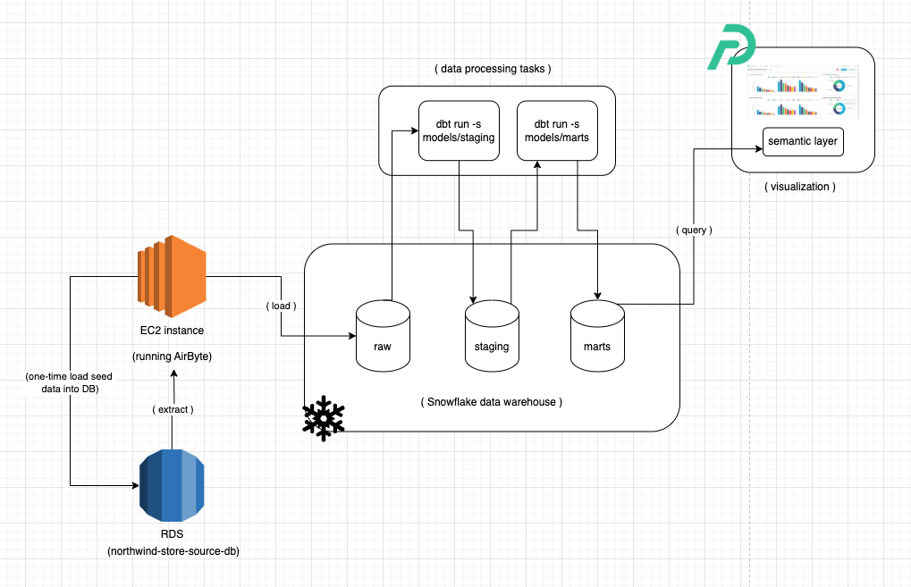
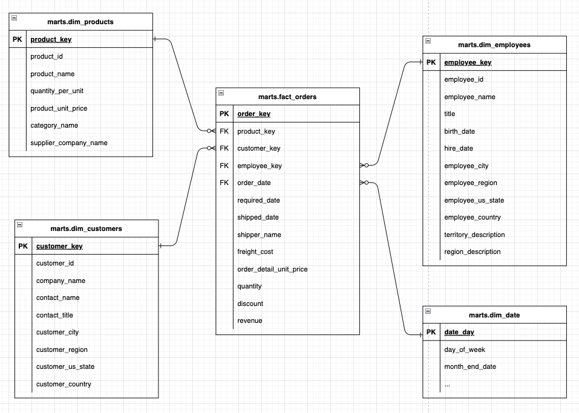
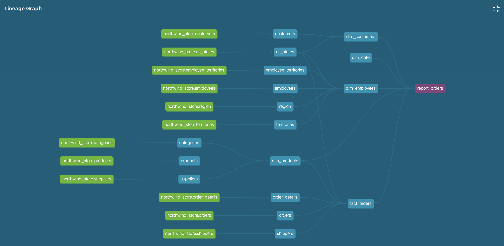
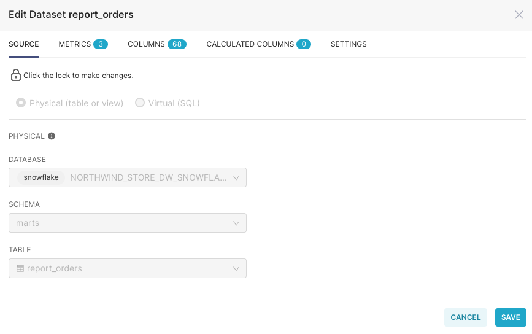

## Northwind Store ELT Demo

### Introduction
This is a demo project to create an ELT pipeline using Airbyte, DBT, Snowflake and Preset.

This makes use of the [Northwind Store](https://github.com/pthom/northwind_psql) example dataset and demonstrates the following:
- extract data and load into Snowflake as `raw` data tables using Airbyte
- use dimensional modeling and dbt to build `mart` data tables
- visualization using Preset

### Business Objectives
What users would find your dataset useful?
- To enable business analysts to explore the data as a semantic model / OLAP cube, built from a one-big-table `mart`
- To enable business leadership to gain insights from the data to understand business operations and where to improve
- To enable other data engineers to build downstream data models and marts

Datasets
- [Northwind Store](https://github.com/pthom/northwind_psql)

Business process modeling
- We model the orders shipping process to determine revenue, profit and whether shipping was late or missing. Example questions:
  - for the COO, provide a breakdown of how many orders were late, how many orders were not shipped, which were the customers impacted?
  - for the CEO, provide an end of month sales report with orders figures aggregated for the end of each month. Provide the ability to slice by the product name.  
  - what are the most profitable products?


### System Architecture



---

### Loading data into local Postgres as source database

- Use the `integration/source/northwind.sql` file to populate your localhost Postgres database
   ```bash
   $ psql -h localhost -d postgres

   postgres=# create database northwind_store
   postgres=# \c northwind_store
   postgres=# \q

   $ psql northwind_store < integration/source/northwind.sql
   $ psql -h localhost -d northwind_store
   ```

- Explore the data set
   ```sql
   select COUNT(*) FROM customers;
   select COUNT(*) FROM products;
   select COUNT(*) FROM orders;
   ```

### Using Airbyte

- Download Airbyte and run it locally
  ```bash
  git clone --depth=1 https://github.com/airbytehq/airbyte.git
  cd airbyte
  docker-compose up
  ```
- Access the local Airbyte UI at `localhost:8080`
- Create a source `northwind_store_pg` for the postgresql database `northwind_store`
  - Host `host.docker.internal`
  - Update method `Detect Changes with Xmin System Column`
- Create a destination `northwind_store_dw_snowflake` for the Snowflake database `NORTHWIND_STORE_DW`
- Create a connection between `northwind_store_pg` and `northwind_store_dw_snowflake`
  - Namespace Custom Format: `raw`

  
  

### Using Snowflake

- Log in to Snowflake
- Go to `worksheets` > `+ worksheet`
- On the top right, select the role `ACCOUNTADMIN.XSMALL_WH`
- On the top left of the worksheet, select `NORTHWIND_STORE_DW.RAW`
- Query one of the synced tables from Airbyte e.g. `select * from customers`


## Using DBT

- Based on the `raw` tables loaded into Snowflake via Airflow, configure DBT to materialize them into `staging` views.

- Dimensional modeling:
  - `fact_orders`
  - `dim_products`, `dim_customers`, `dim_employees`
  - accumulating snapshot `orders_accumulating` shows how long it took to ship orders and whether they were late
  - periodic snapshot `orders_monthly` for orders grouped by `end_of_month` and support slicing by `product_key`
  - one-big-table `report_orders`

  - To run dbt models, first navigate to the `transform/dw` folder
    - To load source data in Snowflake `raw` tables into `staging` tables:
      ```
      dbt run -s models/staging
      ```
    - To load `staging` tables into `mart` tables:
      ```
      dbt run -s models/mart
      ```
    - To run tests:
      ```
      dbt test
      ```

  - Star schema ER diagram

    

  - Generate documentation and lineage
    ```bash
    dbt docs generate && dbt docs serve
    ```

    


## Using Preset for Semantic Layer and Visualization

Create Preset dataset and connect to Snowflake database - `report_orders` mart



Create custom metrics in Preset dataset


Create charts and dashboard


